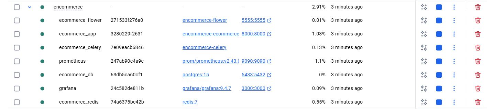
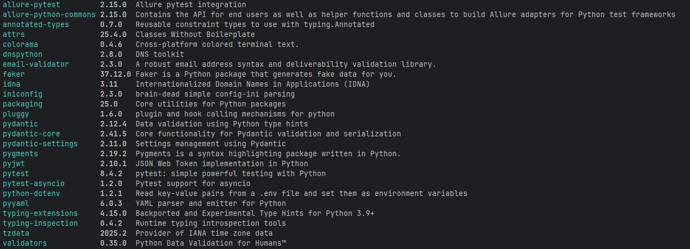
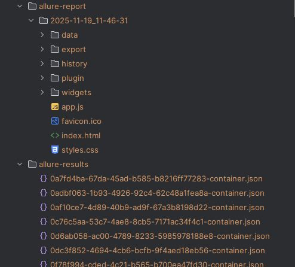
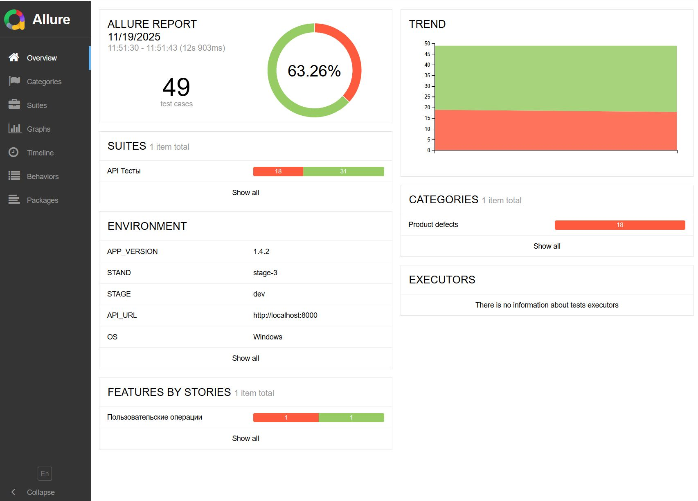
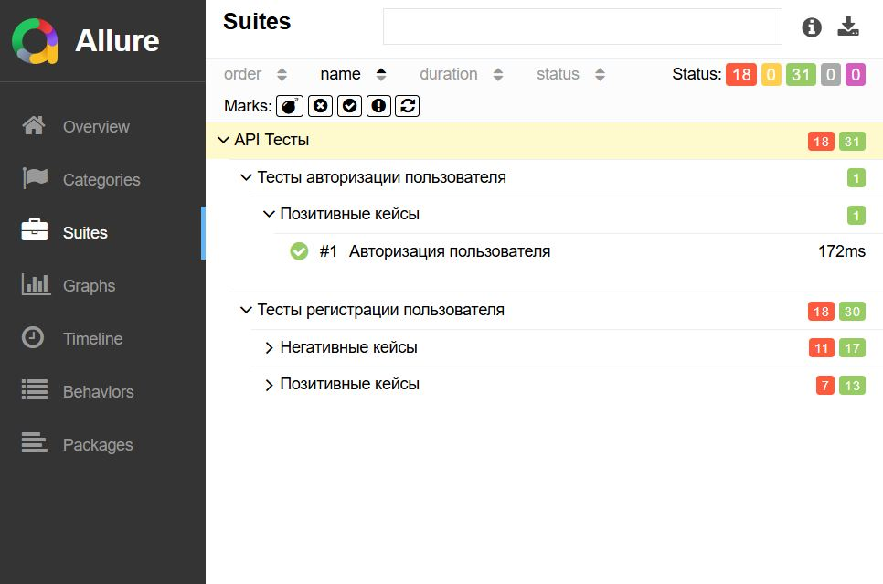

# httpx-async-tests

**ecommerce-async-tests** — демонстрация асинхронных API-тестов для проекта [fastapi_ecommerce_api](https://github.com/kolenkoal/fastapi_ecommerce_api).  

Проект реализован на Python 3.12 с использованием **pytest**, **pytest-asyncio** и **allure** для отчётности.

---

## 📦 Требования

- Python >= 3.12.4
- Poetry >= 1.5 (или любая версия, поддерживающая pyproject.toml)
- 
### Основные зависимости

- `pydantic-settings` (2.11.0 ≤ версия < 3.0.0)
- `allure-pytest` (2.15.0 ≤ версия < 3.0.0)
- `pytest-asyncio` (1.2.0 ≤ версия < 2.0.0)
- `faker` (37.12.0 ≤ версия < 38.0.0)
- `email-validator` (2.3.0 ≤ версия < 3.0.0)
- `pyyaml` (6.0.3 ≤ версия < 7.0.0)
- `validators` (0.35.0 ≤ версия < 0.36.0)
- `pyjwt` (2.10.1 ≤ версия < 3.0.0)

---
### Предустановка

#### Allure
  - 1 Установка Scoop (PowerShell)
```bash
    Set-ExecutionPolicy -ExecutionPolicy RemoteSigned -Scope CurrentUser
    Invoke-RestMethod -Uri https://get.scoop.sh | Invoke-Expression
```
  - 2 Устновка Allure
```bash
  scoop install allure
```
  - 3 Установка Java
```bash
  scoop install temurin25-jdk
```

▶️[Видео: Установка Allure на Windows](https://www.youtube.com/watch?v=MUKkN3h2OCM)

#### Docker

- 1 Выбрать операционную систему
- 2 Запустить файл установки
  
▶️[Видео: Установка Docker Desktop на Windows](https://docs.docker.com/desktop/setup/install/windows-install/)

#### FastApi-ecommerce-api
[project fastapi_ecommerce_api](https://github.com/kolenkoal/fastapi_ecommerce_api)
- 1 Прочитать Readme
- 2 Выполнить устновку по инстуркции

### Устновка из архива

Есть подготовленный архив с проектом. Внёс нужные измениния и всё работает сразу.

- 1 Скачайть архив 📥[encomerce.zip](https://disk.yandex.ru/d/3yxsZPytNxn8dg)
- 2 Разархивировать в любое удобное место
- 3 Открыть командную строку в корневой директории проекта
- 4 Выолнить команду
``` bash
docker-compose up -d --build
```
- 5 Открыть Docker Desktop
- 6 Запустить контейнеры



## ⚡ Установка

1. Клонируем репозиторий:

```bash
git clone https://github.com/SavcukPA/ecommerce_async_tests.git
cd ecommerce_async_tests
```
2. Устанавливаем Poetry и зависимости:
```bash
pip install poetry
poetry install
```

3. Проверяем установленные зависимости:
```bash
poetry show --tree
#или
poetry show
```



### Запуск тестов
- 1 Ввести в терминале
```
pytest -sv tests
```
### После запуска тестов
- 1 Сгенерируются две папки
  - 1 allure-results / папка с результатами тесового прогона
  - 2 allure-report / папка с отчетами
- 2 Открыть папку allure-report и открыть файл index.html в браузере


## Ожидаемый результат отображения отчета index.html




## Структура проекта

```
ecommerce_async_tests/
│
├── allure-report/
├── allure-results/
│
├── assertions/
│   └── auth/
│       ├── login.py
│       └── register.py
│       
│
├── clients/
│   ├── base_client.py
│   ├── event_hooks.py
│   └── headers.py
│   
│
├── data/
│   └── cases/
│       └── register_users.py
│   
│
├── fixtures/
|   ├── init.py
│   └── auth.py
│   
│
├── logs/
│   ├── error.log
│   └── test.log
│
│
├── services/
│   └── auth/
│       ├── models/
│       │   └── user_register.py
│       ├── auth.py
│       ├── endpoints.py
│       └── payloads.py
│       
│
├── tests/
│   └── api_tests/
│       └── auth_tests/
│           ├── user_login_tests.py
│           └── user_register_tests.py
│
├── utils/
│   ├── base_helper_func.py
│   ├── generators.py
│   ├── helper.py
│   ├── hooks.py
│   ├── models.py
│   ├── paths.py
│   ├── regex_patterns.py
│   └── setup_logger.py
│
├── .env
├── .gitignore
├── config.py
├── conftest.py
├── logging_config.yaml
├── poetry.lock
├── pyproject.toml
└── pytest.ini
```

- **allure/** Каталог для хранения Allure-артефактов  
  - **allure-report/** Готовые HTML-отчёты Allure  
  - **allure-results/** Результаты тестов, на основе которых генерируются отчёты  

- **assertions/** Каталог с проверками (assert-логикой) для сервисов и эндпоинтов  
  - **auth/** Проверки для сервиса авторизации  
    - **login.py** Проверки для эндпоинта `/login`  
    - **register.py** Проверки для эндпоинта `/register`  

- **clients/** Каталог конфигурации и логики асинхронного HTTP-клиента  
  - **base_client.py** Базовый клиент и его функционал  
  - **event_hooks.py** Хуки клиента (логирование, обработка событий)  
  - **headers.py** Формирование заголовков запросов  

- **data/** Каталог с тестовыми данными  
  - **cases/** Описание тест-кейсов  
    - **register_users.py** Тест-кейсы для проверки эндпоинта `/register`  

- **fixtures/** Каталог с pytest-фикстурами  
  - **auth.py** Фикстуры для сервиса авторизации  

- **logs/** Каталог файлов логов (создаётся при выполнении тестов)  

- **services/** Каталог с реализацией сервисов (бизнес-логика взаимодействия с API)
    - **models/** Директория с моделями данных, специфичными для Auth  
      - **user_register.py** Модель данных для регистрации пользователя  
    - **auth.py** Модуль с основной логикой сервиса Auth  
    - **endpoints.py** Модуль, содержащий эндпойнты сервиса Auth  
    - **payloads.py** Модуль с payload-ами и структурами данных для запросов Auth
- **tests/** Каталог, содержащий тесты проекта  
  - **api_tests/** Каталог тестов, связанных с API  
    - **auth_tests/** Каталог тестов для сервиса Auth  
      - **user_login_tests.py** Модуль с тестами для эндпойнта авторизации пользователя  
      - **user_register_tests.py** Модуль с тестами для эндпойнта регистрации пользователя 
  - **utils/** Каталог вспомогательных утилит и общих инструментов проекта  
  - **base_helper_func.py** Базовые вспомогательные функции (парсинг токенов, декодирование JWT и др.)  
  - **generators.py** Генераторы случайных данных (строки, email, имена и т.п.)  
  - **helper.py** Общие функции-помощники, используемые в тестах  
  - **hooks.py** Хуки для pytest (дополнительная логика до/после тестов)  
  - **models.py** Pydantic-модели ошибок и структур данных  
  - **paths.py** Централизованное управление путями (кейсами, JSON, ресурсам)  
  - **regex_patterns.py** Набор регулярных выражений для валидаций  
  - **setup_logger.py** Инициализация и конфигурация логирования  

- **.env** Файл переменных окружения для запуска тестов  
- **.gitignore** Исключения для Git  
- **config.py** Основная конфигурация проекта, загрузка настроек через pydantic-settings  
- **conftest.py** Фикстуры и общая подготовка окружения pytest  
- **ex.py** Вспомогательный модуль (пример/экспериментальный код)  
- **logging_config.yaml** Конфигурация логгеров (формат, уровни, хендлеры)  
- **poetry.lock** Зафиксированные версии зависимостей Poetry  
- **pyproject.toml** Описание зависимостей и настроек проекта (Poetry)  
- **pytest.ini** Конфигурация pytest (марки, настройки логгирования и др.)  